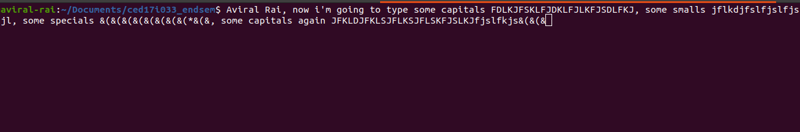
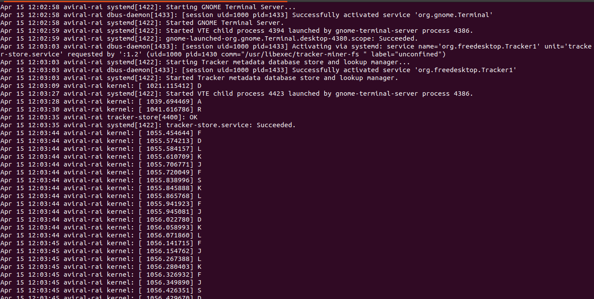
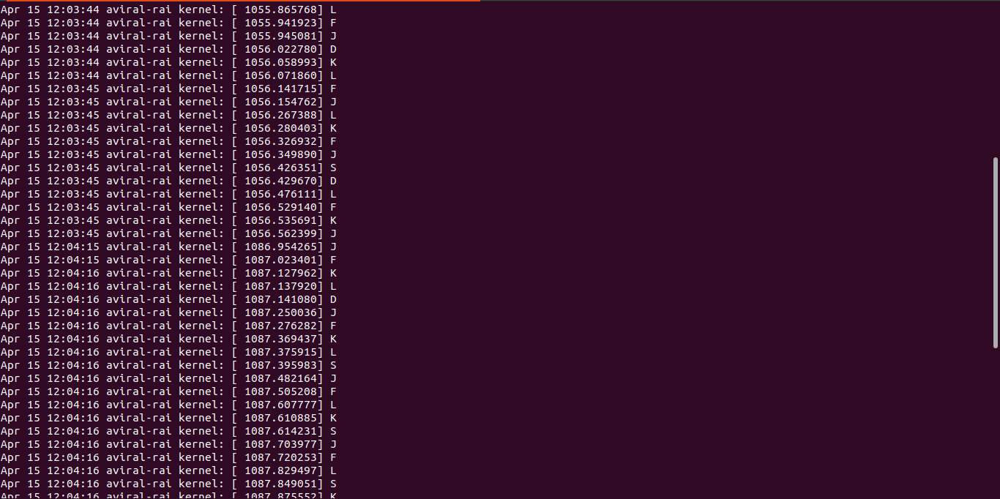
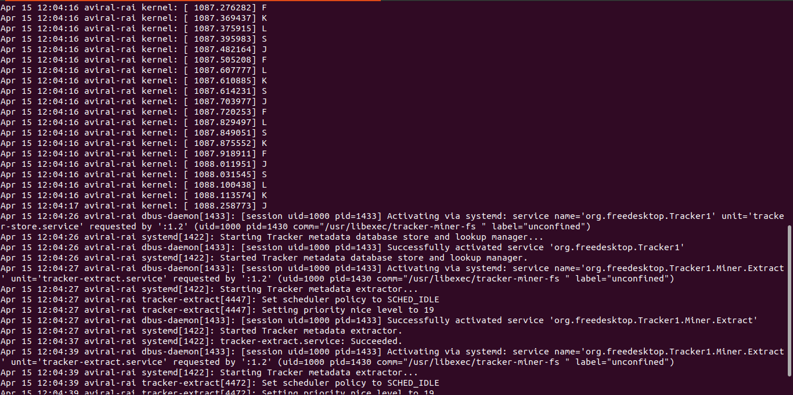

## Write a C program to capture the key strokes of capital letters.
In keylogger.c file, removed the kernel printing whenever typed any key without pressing shift key.
 With pressing shift key, used if condition to capture only CAPITAL letters.
Didn't change kbduskemap.h file, only modified the keylogger.c file in such a way to print only CAPITAL letters in the log file.
## Input Terminal:

## Output Terminal:

