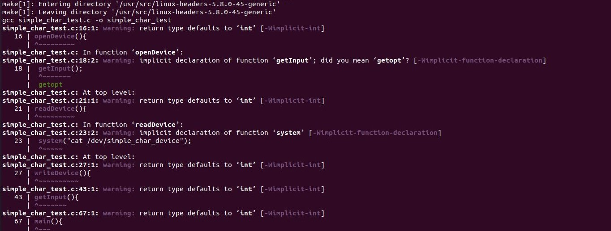

# Exercise - 6
Write a simple Char Device Driver. Test it by using passing on data.
# Overview
Implemented a Simple Character device driver that does basic operations such as read,write,open and exit. After compiling it as module loaded it to the kernel and executed the test_driver.
```
aviral@rai:~/char$ make
```
This commmand is used to compile the souce code simple_char_driver.c to create a module called simple_char_driver.ko and will also create a object file for testing i.e. simple_char_test.

```
aviral@rai:~/char$ sudo insmod simple_char_driver.ko
```
This command will call init_module() which is called when the module is inserted into the kernel or loaded to the kernel.
```
aviral@rai:~/char$ cat /proc/devices | grep simple_driver
```
This command will display that our new driver is installed.\
```
aviral@rai:~/char$ ./simple_char_test 
```
This is the tester file for output.
```
aviral@rai:~/char$ sudo rmmod simple_char_driver.ko
```
This command will call cleanup_module() which is called just before the module is unloaded from the kernel.
# Ouput
\
This is the screenshot of the driver running.\
\
This is kernel log when module is loaded printing the message.\
\
This is kernel log when module is unloaded printing the message.\
